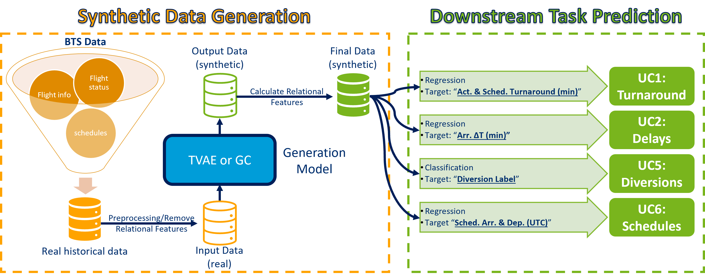

# ✈️ SynFlyInf: Synthetic Flight Information for Air Transportation

This repository offers advanced tabular data generation models tailored for aviation data. It includes implementations of multiple synthetic data generators designed to synthesize realistic flight records while preserving essential statistical properties, maintaining data diversity, and ensuring both high fidelity and practical utility for downstream predictive tasks.

## 📖 Overview

The work presented in this repository addresses the challenges of data scarcity and the limited availability of historical data in air transportation management. It leverages state-of-the-art generative AI techniques to create synthetic flight information and trip logs across various scenarios. Furthermore, it evaluates how augmenting limited real data with synthetic data can improve the training of machine learning models for various downstream prediction tasks.

Historical flight data from the [TranStats: Airline On-Time Performance dataset](https://transtats.bts.gov/Tables.asp?QO_VQ=EFD&QO_anzr=Nv4yv0r%FDb0-gvzr%FDcr4s14zn0pr%FDQn6n&QO_fu146_anzr=b0-gvzr), collected by the [U.S. Bureau of Transportation Statistics (BTS)](https://www.bts.gov/), is used to train the generative models. The resulting synthetic data is employed to support and enhance the prediction of different use cases (UCs) identified within the SynthAIr project framework, namely:

1. 🔄 UC 1: Prediction of Turnaround Times 
2. ⏱️ UC 2: Prediction of Flight Delay
3. 🆘 UC 5: Prediction of Flight Diversions
4. 🗓️ UC 6: Prediction of Flight Schedules

  <div align="center">
    
    <br/>
    <em>Figure 1: Flight Data Generation Architecture.</em>
  </div>


## 🤖 Models Implemented

This repository implements two synthetic data generation approaches specifically adapted for aviation data:

1. 📊 **GaussianCopula (GC):** A statistical model that captures complex dependencies between flight variables while preserving their individual marginal distributions. It is particularly effective for generating tabular data with mixed variable types.

2. 🧠 **Tabular Variational Autoencoder (TVAE):** A deep generative model that uses a neural network-based encoder–decoder architecture to learn latent representations of tabular data. It is capable of capturing nonlinear relationships between variables and is well-suited for generating synthetic data with high fidelity.

The repository offers a complete pipeline from data preprocessing through model training, generation, and comprehensive evaluation across statistical similarity, diversity, fidelity, and utility dimensions.

## 🧩 Installation and Setup

### 🖥️ System Requirements

- Python 3.9 or newer.
- At least 16GB RAM (32GB+ recommended for larger datasets).
- Sufficient disk space for storing models and synthetic datasets.

### 🛠️ Installation

1. **Clone the repository:**
   ```bash
   git clone https://github.com/SynthAIr/synflyinf.git
   cd synflyinf
   ```

2. **(Recommended) Create and activate a virtual environment:**

  - On Unix/macOS:
    ```bash
    python -m venv venv
     source venv/bin/activate  
    ```

  - On Windows:
    ```bash  
    python -m venv venv
    venv\Scripts\activate
    ```

  - Using conda:
    ```bash
    conda create -n synflyinf python=3.10
    conda activate synflyinf
    ```

3. **Install dependencies:**
   ```bash
   pip install --upgrade pip
   pip install -r requirements.txt
   ```

## 📂 Repository Structure

```
├───data/                                     # Data used or generated
│   ├───preprocessed_data/                    # Pre-processed flight records
│   ├───raw_data/                             # Raw flight records from BTS
│   ├───uc1_outputs/                          # Results for use case 1
│   │   ├───discriminative_score/             # Fidelity evaluation results
│   │   ├───predictive_score/                 # Utility evaluation results
│   │   ├───real_vs_synth/                    # Real and synthetic datasets
│   │   ├───statistical_similarity/           # Statistical evaluation results
│   │   └───synthesizers/                     # Trained generative models
│   ├───uc2_outputs/                          # Results for use case 2
│   │   ├───discriminative_score/             # Fidelity evaluation results
│   │   ├───predictive_score/                 # Utility evaluation results
│   │   ├───real_vs_synth/                    # Real and synthetic datasets
│   │   ├───statistical_similarity/           # Statistical evaluation results
│   │   └───synthesizers/                     # Trained generative models
│   ├───uc5_outputs/                          # Results for use case 5
│   │   ├───discriminative_score/             # Fidelity evaluation results
│   │   ├───predictive_score/                 # Utility evaluation results
│   │   ├───real_vs_synth/                    # Real and synthetic datasets
│   │   ├───statistical_similarity/           # Statistical evaluation results
│   │   └───synthesizers/                     # Trained generative models
│   └───uc6_outputs/                          # Results for use case 6
│       ├───predictive_score/                 # Utility evaluation results
│       └───real_vs_synth/                    # Real and synthetic datasets
├── notebooks/                                # Jupyter notebooks for different use cases
│   ├── 1_ExploratoryAnalysis.ipynb           # BTS data exploration and preprocessing
│   ├── 2_UC2-FlightDelayPrediction.ipynb     # Training, generation and evaluation
│   ├── 3_UC6-FlightSchedulesPrediction.ipynb # Training, generation and evaluation
│   ├── 4_UC1-TurnaroundTimePrediction.ipynb  # Training, generation and evaluation
│   └── 5_UC5-FlightDiversionPrediction.ipynb # Training, generation and evaluation
├── LICENSE                                   # CC BY-SA 4.0 License
├── README.md                                 # Project documentation
└── requirements.txt                          # Project dependencies and metadata
```

## 📄 Content Description  

### ``1_ExploratoryAnalysis.ipynb``

- Preprocessing and feature engineering of BTS flight records for flights departing from or arriving at New York in January 2023
- Exploratory data analysis
- Integration of weather data (METARs)
- Feature selection leading to three distinct dataframes used for generative modeling experiments

### ``2_UC2-FlightDelayPrediction.ipynb``

- Five synthetic data generation experiments
- Diversity assessment: Verifies whether the synthetic dataset captures the variability of the real data
- Statistical assessment: Compares distributions and correlation structures between real and synthetic data
- Fidelity assessment: Evaluates the ability of classification algorithms to distinguish between real and synthetic data
- Utility assessment: Trains machine learning models for arrival delay prediction using synthetic data, and compares their performance to models trained on real data

### ``3_UC6-FlightSchedulesPrediction.ipynb``

- Reuses the synthetic data generated in UC2
- Diversity, statistical, and fidelity assessments are identical to UC2
- Utility assessment: Trains machine learning models on synthetic data to predict departure and arrival delays, and infers flight schedules from the predicted delay values

### ``4_UC1-TurnaroundTimePrediction.ipynb``

- Introduces two new features: *"Actual Turnaround Time"* and *"Scheduled Turnaround Time"*
- Includes two synthetic data generation experiments
- Diversity, statistical, and fidelity assessments
- Utility assessment: Uses synthetic data to train models for predicting turnaround times in both tactical (scenario 1) and pre-tactical (scenario 2) phases

### ``5_UC5-FlightDiversionPrediction.ipynb``

- Adds a new feature: *"Diversion Label"*
- One synthetic data generation experiment: generates synthetic instances of diverted flights to augment the historical dataset and address class imbalance
- Diversity, statistical, and fidelity assessments 
- Utility assessment: Compares the performance of flight diversion prediction models trained on real data versus models trained on the augmented dataset

## 🙏 Attributions and Acknowledgments

This repository is part of the SynthAIr project that has received funding from the SESAR Joint Undertaking under grant agreement No 101114684 under European Union's Horizon 2020 research and innovation programme.

The implementation builds upon several foundational research papers and implementations:

- **TVAE:** Based on "Modeling Tabular Data using Conditional GAN" by Xu et al.
- **Gaussian Copula:** Based on "On Default Correlation: A Copula Function Approach" by Li

### Code Adaptations

The repository incorporates code adapted from several open-source projects:

1. **CTGAN** (https://github.com/sdv-dev/CTGAN) by DataCebo, Inc.
2. **Copulas** (https://github.com/sdv-dev/Copulas) by DataCebo, Inc.
3. **SDMetrics** (https://github.com/sdv-dev/SDMetrics) by MIT Data To AI Lab

All adapted code contains attribution notices acknowledging the original source and license.

## 📜 License

This repository is licensed under the Creative Commons Attribution-ShareAlike 4.0 International License (CC BY-SA 4.0).

The repository incorporates components with various licenses:
- CTGAN & Copulas: Business Source License 1.1
- SDMetrics: MIT License

Users should consult the full license texts for specific use cases, particularly for commercial applications.
